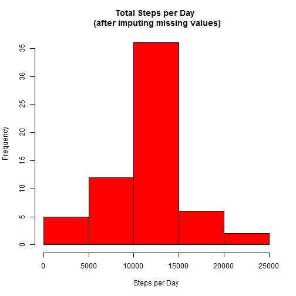

## Reproducible Research: Peer Assessment 1


```r
library(plyr)
library(lattice)
```

## Loading and preprocessing the data

if not unzipped, unzip the data set

```r
if (!file.exists("activity.csv"))
{
    unzip("activity.zip", overwrite = TRUE)
}

activity <- read.csv("activity.csv", na.strings = "NA", stringsAsFactors = FALSE)

#convert the strings to dates
activity$date <- as.POSIXct(activity$date, format = "%Y-%m-%d")
```

## What is mean total number of steps taken per day?

### 1. Calculate the total number of steps taken per day
There are several way to do aggregations in R, could be using "tapply" or "aggregate"
or "ddply" as in this case

```r
stepsPerDay <- ddply(activity, "date", summarize, totalSteps = sum(steps))
```

### 2. Make a histogram of the total number of steps taken each day

```r
hist(stepsPerDay$totalSteps, 
     xlab = "Steps per Day", 
     main = "Histogram for Total Steps per Day", 
     col = "blue"
)
```


### 3. Calculate and report the mean and median of the total number of steps taken per day
Mean

```r
mean(stepsPerDay$totalSteps, na.rm = TRUE)
```

```
## [1] 10766.19
```

Median

```r
median(stepsPerDay$totalSteps, na.rm = TRUE)
```

```
## [1] 10765
```

## What is the average daily activity pattern?

### 1. Time series plot (i.e. type = "l") of the 5-minute interval (x-axis) and the average number of steps taken, averaged across all days (y-axis)

```r
stepsPerInterval <- ddply(activity, "interval", summarize, avg = mean(steps, na.rm = TRUE))

plot(stepsPerInterval$interval, stepsPerInterval$avg, type = "l", 
     ylab = "Average number of steps",
     xlab = "Intervals",
     main = "Average number of steps per interval")
```


### 2. Which 5-minute interval, on average across all the days in the dataset, contains the maximum number of steps?

```r
stepsPerInterval[which(stepsPerInterval$avg == max(stepsPerInterval$avg)),]
```

```
##     interval      avg
## 104      835 206.1698
```

## Imputing missing values

### 1. Calculate and report the total number of missing values in the dataset

```r
sum(is.na(activity$steps))
```

```
## [1] 2304
```


### 2. Devise a strategy for filling in all of the missing values in the dataset.
### 3. Create a new dataset that is equal to the original dataset but with the missing data filled in.
The mean of the 5 minute interval will be used, it is already calculated in the "stepsPerInterval" data frame

```r
#First merge the "activity" with the "stepsPerInterval", the join will be based on the "interval"
#After the merge the column "avg" will be available to update the "NA" cases.
activityNew <- merge(activity, stepsPerInterval, by.x = "interval")

#Now we update the "NA" values with the avg (mean) per interval previously joined, using "ifelse" to determine
#if the value is "NA". 
activityNew$steps <- ifelse(is.na(activityNew$steps), activityNew$avg, activityNew$steps)

#Remove the "avg" column (not required for the following calculations)
activityNew <- activityNew[, 1:3]
```

### 4. Make a histogram of the total number of steps taken each day and Calculate and report the mean and median total number of steps taken per day. 

```r
stepsPerDayNew <- ddply(activityNew, "date", summarize, totalSteps = sum(steps))

hist(stepsPerDayNew$totalSteps, 
     xlab = "Steps per Day", 
     main = "Total Steps per Day \n (after imputing missing values)", 
     col = "red"
)
```



Mean

```r
mean(stepsPerDayNew$totalSteps, na.rm = TRUE)
```

```
## [1] 10766.19
```

Median

```r
median(stepsPerDayNew$totalSteps, na.rm = TRUE)
```

```
## [1] 10766.19
```

### Do these values differ from the estimates from the first part of the assignment? What is the impact of imputing missing data on the estimates of the total daily number of steps?

The mean is the same in both cases. The median is now equal to the mean, showing a small difference with the previous one because of the replaced missing values.


## Are there differences in activity patterns between weekdays and weekends?

### 1. Create a new factor variable in the dataset with two levels - "weekday" and "weekend" indicating whether a given date is a weekday or weekend day.

```r
activityNew$typeofday <- as.factor(ifelse(weekdays(activityNew$date) == "Sunday" | weekdays(activityNew$date) == "Saturday", "weekend", "weekday"))
```

### 2. Make a panel plot containing a time series plot (i.e. type = "l") of the 5-minute interval (x-axis) and the average number of steps taken, averaged across all weekday days or weekend days (y-axis).


```r
stepsPerIntervalTypeofDay <- ddply(activityNew, c("interval","typeofday"), summarize, avg = mean(steps))

xyplot(avg~interval | typeofday, 
      data = stepsPerIntervalTypeofDay,
      layout = c(1,2),
      type = 'l',
      xlab = 'Interval',
      ylab = 'Steps'
)
```


